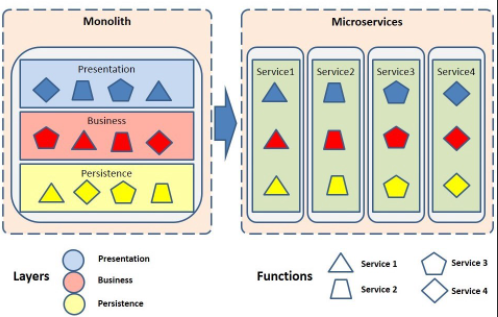

#### Monolithic Mimarisi

```bash
Monolithic architecture yazılımın self-contained(kendi kendine yeten) olarak tasarlanması anlamına gelmektedir. 
Bir standart doğrultusunda “tek bir parça” olarak oluşması da diyebiliriz.
Bu mimarideki component’ler loosely coupled olmasından ziyade, interdependent olarak tasarlanmaktadır.
```
Buradan yola çıkarak kısaca şu tanımı yapabiliriz ->
Monolithic mimari kendi kendine yetebilecek bir uygulamada ki bütün fonksiyonalitelerin tek bir çatı altında geliştirilmesidir.

Günümüze baktığımızda kurumsal projeler, Service Oriented Architecture(SOA) ile geliştirilmeye başlanmış ve büyük ölçüde yerini zaten almış durumdadır. Geleneksel SOA mimarisinde geliştirilen tüm component’lerin de, tek bir çatı altında olduğunu da görmekteyiz. Çünkü yakın geçmişten bu yana SOA ile birlikte manageability(yönetilebilirlik), maintenance(bakım) ve interoperability(birlikte çalışabilirlik) gibi kavramlar göz önüne alınmıştır. Günümüzdeki şirketlerin IT yaklaşımlarına baktığımızda ise genelde IT for Business kapsamında olduğundan dolayı, her zaman pazarlama odaklı gitmektedirler. Bu doğrultuda sürekli artan bir entegrasyon ihtiyaçları doğmaktadır. Bu bitmeyen ihtiyaçlar doğrultusunda ise Monolithic architecture ile tasarlanmış olan SOA’lar, gitgide istemsizce büyümektedirler.

Bu noktaya kadar her şey “büyüme” haricinde normal görünebilir fakat problem nerede/ne zaman başlıyor? İşte bu soruya geçmeden önce Monolithic architecture’ın dezavantajlarını bir ele alalım.

- Tüm component’lerin aynı framework, aynı programlama dili ile geliştirilmesinin gerekmesi
- Bir component üzerinde olan değişiklik için, tüm monolith yapının tekrar deploy edilmesi ve restart edilmesi durumunda kalınması
- Versiyon yönetiminin gitgide zorlaşması
- Birbirlerine olan bağımlılıklarından dolayı, bir component için yapılan değişimden diğer component’in etkilenebilmesi
- Continuous Delivery’nin uygulanmasının zorlaşması


Bu dezavantajların bazıları monolithic mimarinin büyümesi ile gelmese de en major problemlerden birtanesi, 
monolithic mimari üzerindeki component’lerden herhangi birinde olan değişikliğin deployment’ı yapıldığında,
bu durumdan diğerlerinin de etkilenebiliyor/etkilenebilecek olmasıdır.

#### Microservice Mimarisi

Monolith yapı gibi tüm sistemin self-contained olarak geliştirilmesi yerine, her bir parçanın/component’in
kendi bünyesinde self-contained olarak modüler bir şekilde geliştirildiğini görebilmekteyiz. 

Microservice tam olarak şöyle tanımlanabilir: Birbirinden bağımsız olarak çalışan ve birbirleriyle haberleşen bireysel servislerdir.
Her servis kendisine ait olan iş mantığını yürütür ve diğer servislerin iş mantığı ile ilgilenmez.
Plansız bir şekilde genişleyen monolithic uygulamanın hantallığını, karmaşıklığını azaltan ve yönetimini kolaylaştıran bir mimaridir.

MicroService Mimarisinin Faydaları;

- Servisler farklı dillerde ve farklı framework’lerde geliştirilebilir
- Birbirlerinden bağımsız olarak her bir servis değişebilir, kolay test ve build yapılabilir
- Continuous delivery’e olanak sağlar ve hızlı deployment’lar gerçekleştirilebilinir
- Her bir servisi birbirinden bağımsız olarak scale edebilme olanağı sağlar
- Her bir servis birbirinden bağımsız olacağı için, code base’i sade ve maintenance’ı kolay olacaktır
- Versiyonlama kolay bir şekilde yapılabilecektir