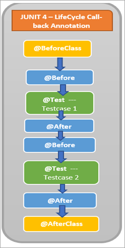
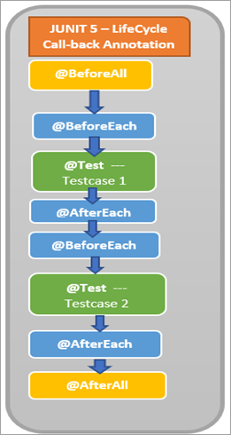

####JUnit nedir?
Java tabanlı kodların test edilmesi için kullanılan bir Unit Test – Birim Testi kütüphanesidir.

####Test nedir?
Belirlenen girişlere göre beklenen bir sonuç vermesini denemek için kullanılan geliştirme-deneme yöntemidir.

####Unit Test nedir?
Unit test veya birim testi programları oluşturulan alt parçaların-birimlerin test edilmesidir.

NOT: Java gibi OOP tabanlı programlama dillerinde bu parçalar metot olarak adlandırılır.

####Neden kullanılır?
Programlama dilleri temel olarak giriş-input alarak çıktı-output üretir.

Girişlerin ve çıkışların kaynağı farklı olsa da aynı girişlerin aynı sonuç vermesi beklenir.

Bu beklentiyi doğrulamak için her bir giriş ve çıkış değerinin kontrolünün tek-tek yapılması gerekir.

Her bir giriş ve çıkış değerinin tek-tek yapılması yazılım geliştirme sürecini uzatır.

JUnit gibi araçlar test işlemlerini kolaylaştırır ve çeşitli ek özellikler sunarak bu süreyi kısaltır.

NOT: Unit test yazılan kodların hatalarını bulmak için kullanılmaz.

JUnit ayrıca TDD veya test odaklı geliştirme yapmayı sağlar.

TDD yazılım geliştirme öncesi yapılan planın test edilerek kodun yazılmasıdır.

Aşağıda bazı test yöntemleri yer almaktadır.

- Unit Testing
- Integration Testing
- Smoke Testing
- Stress Testing
- Security Testing
- Smoke Testing
- Load Testing




####JUNIT4
- @BeforeClass ile açıklama eklenen yöntem, sınıfın başında bir kez çalıştırılır.
- @Before ile açıklama eklenen yöntem, Test senaryosu 1 başlamadan önce yürütülür.
- @Test ile açıklama eklenen Testcase1 yöntemi, sınıftaki test örneğidir.
- @After ile açıklama eklenen yöntem, Testcase 1 yürütmeyi tamamladıktan sonra çalışır.
- @Before ile açıklama eklenen yöntem, Test Case 2 başlamadan önce yürütülür.
- @Test ile açıklanmış Testcase2 yöntemi, sınıftaki test durumudur.
- @After ile açıklama eklenen yöntem, Testcase 2 yürütmeyi tamamladıktan sonra çalışır.
- @AfterClass ile açıklanmış yöntem, hem test senaryosu 1 hem de 2 yürütüldükten sonra sınıfın sonunda bir kez çalıştırılır.

####JUNIT5
- @BeforeAll ile açıklama eklenen yöntem, sınıfın başında bir kez çalıştırılır.
- @BeforeEach ile açıklama eklenen yöntem, Test Case 1 başlamadan önce çalıştırılır.
- @Test ile açıklama eklenen Testcase1 yöntemi, sınıftaki test örneğidir.
- @AfterEach ile açıklama eklenen yöntem, Testcase 1 yürütmeyi tamamladıktan sonra çalışır.
- @BeforeEach ile açıklama eklenen yöntem, Testcase 2 başlamadan önce çalıştırılır.
- @Test ile açıklanmış Testcase2 yöntemi, sınıftaki test durumudur.
- @AfterEach ile açıklama eklenen yöntem, Testcase 2 yürütmeyi tamamladıktan sonra çalışır.
- @AfterAll ile açıklama eklenen yöntem, hem test senaryosu 1 hem de 2 yürütüldükten sonra sınıfın sonunda bir kez çalıştırılır.

 #### TDD (Test Driven Development)
Test Driven Development (TDD), kodun ne yapacağını belirlemek ve doğrulamak için test senaryolarının geliştirildiği bir yazılım geliştirme yaklaşımıdır.
TDD yaklaşımının avantajları arasında daha hızlı geri bildirim, yüksek kabul oranı,
daha düşük proje kapsamı ve gereğinden fazla mühendislik, müşteri odaklı ve yinelenen süreçler, modüler, esnek ve sürdürülebilir kodlar yer alır.

Test odaklı geliştirme, kodlama, test ve tasarımın birlikte çalıştığı bir programlama tarzını ifade eder.
Basit bir ifadeyle, önce her işlev için test senaryoları oluşturulur ve test edilir.
Bu aşamada test başarısız olursa, testi geçmek ve kodu basit ve hatasız hale getirmek için yeniden kod yazılır.

- TDD Adımları
```
1. Bir test yazılır.
2. Test başarısız olur.
3. Test başarılı hale getirilir.
4. Mevcut bütün testlerin başarılı olması sağlanır.
5. Kod refactor edilir. Yani kodda iyileştirme ve(ya) temizleme yapılır.
```

####Obje mock’lama (Mockito)

Mocking(mocklama), popüler yazılım metodolojisi olan TDD ve özelde birim testlerinin (unit test), test ettikleri sistemi izole etmede kullandığı yöntemlerden biridir.
Bu yöntemler, geniş anlamıyla test dublörleri (test double) olarak tanımlanabilir. Test dublörleri, test edilen sistemin bağımlı olduğu diğer birimlerin yerini tutar. Bu izolasyona birim testlerinde ihtiyaç duyulmasının temelde iki sebebi vardır:

- Birim testleri, genelde test ettikleri sistemin kendisi ile ilgili varsayımları doğrulamak için yazılır.
- Test dublörleri, davranış ve kullanım şekillerine göre çeşitlenir. Bunlardan en çok kullanılanları dummy, fake, stub, spy ve mock‘tur denebilir.
- Bu çeşitliliğe sebep olan genel faktörler, bu dublörlerin beklenen işi yapıp yapmadığı ve yaparken nasıl bir davranış gösterdiği ile ilgilidir.

Mock’ların genel kullanım şekli, yerine geçtiği bağımlılık üzerinde,
test edilen sistemin yapması beklenen işlemlerin yapılıp yapılmadığını doğrulamak olarak tanımlanabilir.
Mock nesnelerinin casus nesnelerinden (spy) farkı, her ikisi de üzerlerinde yapılan işlemleri takip ederken,
mocklar bu işlemi testlerin doğrulama (assert) kısmına da entegre ederler.

####Spring Profile

Profile anotasyonu uygulamamızdaki farklı çalışma isterlerine göre programımızın hangi işlevinin çalışacağını çalışacağını isteğimize göre seçmemizi sağlamaktadır.

Küçük bir örnek vermek gerekirse iki adet çıktı üreticimiz var birisi PDF çıktısı diğeri ise HTML çıktısı ürettiğini varsayalım.
Bu iki çıktınında kodlarını yazacağız ardından istediğimiz bir çıktıyı seçip uygulamanın o seçtiğimiz işlevi yapmasını sağlacağız. 

Pdf servisimizi yazalım
```
@Component
@Profile("pdf")
public class PrintServicePdf implements PrintService{
    @Override
    public String printHello(String name) {
        return "Pdf Printed : " + name ;
    }
}
```
Html servisimizi yazalım
```
@Component
@Profile("html")
public class PrintServiceHtml implements PrintService{
    @Override
    public String printHello(String name) {
        return "Html Printed : " +name;
    }
}
```

Component anotasyonu ile işaretlenmiş olan beanimizi @Profile olarak işaretliyoruz ve bir isim veriyoruz.
Bu işaretlemeyi yaptıktan sonra hangi Spring Componenetinin çalışacağını application.properties dosyasında belirtiyoruz.
```
spring.profiles.active=pdf
```
spring.profiles.active attribute’na pdf i seçerek Pdf componentinin çalışmasını sağlamaktayız.
Html yazarsak o component çalışacaktı.

```
@RestController
@RequestMapping(path = "/")
public class PrintController {
@Autowired
private PrintService printService;

    @RequestMapping(path = "hello/{name}", method = RequestMethod.GET)
    public String hello(@PathVariable(value = "name") String name){
        return printService.printHello(name);
    }
}
```
Controller’imiz de yaptığımız işlemlerden bahsedecek olursak. http://localhost/hello adresinden bir parametre almayı bekliyoruz.
Bu göndereceğimiz parametre sonucunda PrintService’miz çalışacak ve application.properties dosyasında hangi componenti seçtiysek o çalışıp bize değer döndüerecektir.